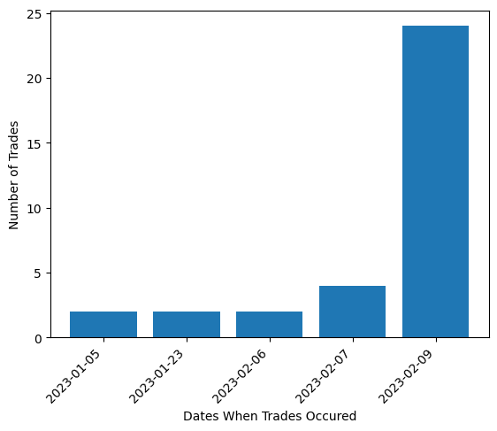
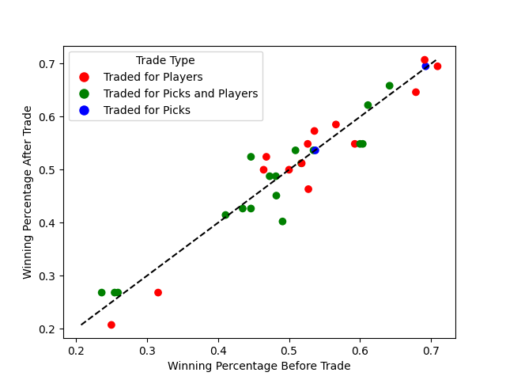

# Team-Trade-Effects
By Colin Lauffer, Brett Loy, and Jorah Razumeyko 

## Introduction:

The primary objective of this project is to investigate the relationship between NBA player trades during an NBA season and the subsequent performance of the teams involved. Information about this relationship can be useful for team Management and Ownership, Coaches and Players, Sports Analysts, and ordinary fans. This can guide team management and owners on whether they should pursue trades. Similarly it can inform players on where and whether they should want to be traded. Sports Analysts researchers can gain a better understanding of the effects of player trades in professional sports and Fans can decide if their team will be better off after a trade.
During the regular season–prior to the trade deadline in February–Teams will often make trades to try to improve their team performance in preparation for the playoffs. These trades can be rather small and only involve a backup player or can include entire reworks of the starting lineup of players. The NBA also has a draft lottery system where each team can select young athletes who declared for the draft (for more information on the [NBA Draft](https://en.wikipedia.org/wiki/NBA_draft)). Through a [draft lottery](https://www.nba.com/news/nba-draft-lottery-explainer), the league decides which teams get to pick players first: teams that performed poorly in the previous season have a higher chance of getting to pick earlier. This is designed to help the worst teams get the most promising young players entering the league. Teams can trade these future draft picks in exchange for current players. As a result, a team may trade future picks away to improve their current roster, increasing the chance of making the playoffs and winning the championship. In contrast, teams that are already doing poorly, may trade their current players for future picks, both to improve the likely-hood of getting a high draft lottery number and to get other teams’ picks.
Such teams that are trying to perform worse are known as ”tanking” teams.
For our project we can look at team success throughout the season, which can be measured by regular season performance, both through the ratio of wins to losses and by point differential—how many points the teams win or lose by.

## Methodology and Data:
Our research question is to determine if teams that trade during the season improve their winning percentage and their point differential. To check this we looked at every teams’ trades during the 2022-23 regular season and their game outcomes during the season.
For our project we relied on web scraping techniques and data manipulation in Python. We began by obtaining [all transactions that occurred during the 2022-23 season](https://www.basketball-reference.com/leagues/NBA_2023_transactions.html) and selecting transactions that were trades. We reformatted this, such that instead of showing what teams traded on a specific day we would see what dates a specific team traded on. Using this we categorized the trade by whether it included picks, players, or a combination of both. After this we also scraped the URLs for each player that was traded and then scraped those URLs to obtain their salary for 2022-23.
After obtaining the data on trades, we began to collect data on every team’s in season schedules for 2022-23. By scraping the ESPN schedule for each team, we obtain the dates on which they played, the outcome of each game, and their wins to losses record. We used this to calculate the point differential, cumulative point differential, average point differential, and win percentage for each game. This allowed us to compare performance before and after they made a trade to see if trades did have an impact on team performance. We combined the data on players’ salary, game performance, and trades into a separate data frame for each team. Afterwards, for every trade a team made we documented the win percentage on the day of the trade and the win percentage they had at the end of the season, repeating this for all 30 teams. Repeating this step for average point differential we got two data frames for comparing team performance before and after a trade, which are depicted in [Figure 2](#figure-2) and [Figure 3](#figure-3).
Finally, we were looking at player salary as another measure for how a team was attempting to use a trade. By scraping all the links from players who were traded from the transactions page we were able to collect all the salaries of the players who were traded, allowing us to scrape each individual players statistics page. The idea behind adding player salary was that teams who traded for players with a lot more salary were looking to add superstar talent and ”go all in” to try and win even if it meant giving up significant future draft compensation. We combined the salary of all the players traded and added it to the data frame; additionally we found the change in average point differential and winning record before and after a trade. This data is
depicted in [Figure 4](#figure-4) and [Figure 5](#figure-5).

## Visualization and Results

### Figure 1: Trade Date

The above [Figure 1](Trade_Dates.png) shows when trades occur during the regular season. It is noteworthy that even though the season started in October, teams only started trading in January. Furthermore, they almost all occur on the trade deadline for the regular season, since that is the last day to trade.

### Figure 2: Team Winning Percentage Before and After a Trade

In [Figure 2](#figure-2), each dot corresponds to a trade that a team made during the 2022-23 NBA Season. The x-axis corresponds to the winning percentage of the team before the trade and the y-axis corresponds to the winning percentage after the trade. The dotted line therefore represents maintaining the same winning percentage before and after the trade. In other words, if a point is on or close the line, then the trade had no impact on team’s wins. If a point is below the line, then the team was worse after the trade; if a point is above the line, then the team was better off after the trade. We can see that most teams, preformed better or the same after the trade. Furthermore, teams that already had a high winning percentage (above 40%) before the trade, were less likely to do worse after the trade if they trade for only players instead of players and picks. It is also notable that the teams with the highest winning percentage in the league, maintained their winning percentage after the trade. Therefore it is safe for the best teams in the league during the regular season to experiment with improving their roster to improve their chances of winning in the playoffs.

### Figure 3:  Team Average Point Differential Before and After a Trade

Similar to the previous plot, in [Figure 3](#figure-3), each dot corresponds to a trade that a team made during the 2022- 23 NBA Season. The x-axis corresponds to the average point differential of the team before the trade and the y axis corresponds to the average point differential after the trade. The dotted line therefore represents maintaining the same average point differential before and after the trade. If a point is below the line, then the team played worse after the trade; if a point is above the line, then the team played better after the trade. Here it is noteworthy that the teams who did worse after a trade, mostly traded for only picks or for picks and players. This suggests that it is better to prioritize players over picks to ensure success. Additionally, since the majority of teams that traded are have a higher average point differential after the trade, it is useful to

